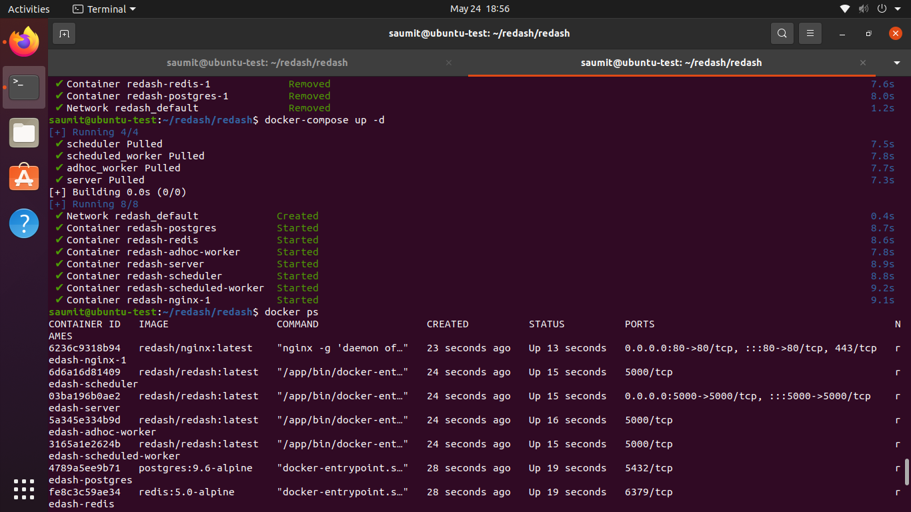
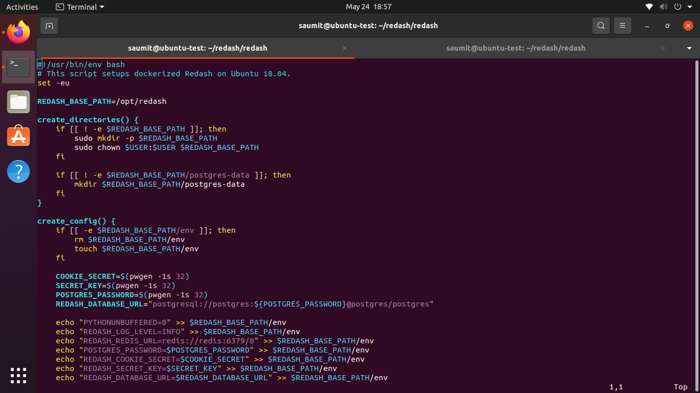
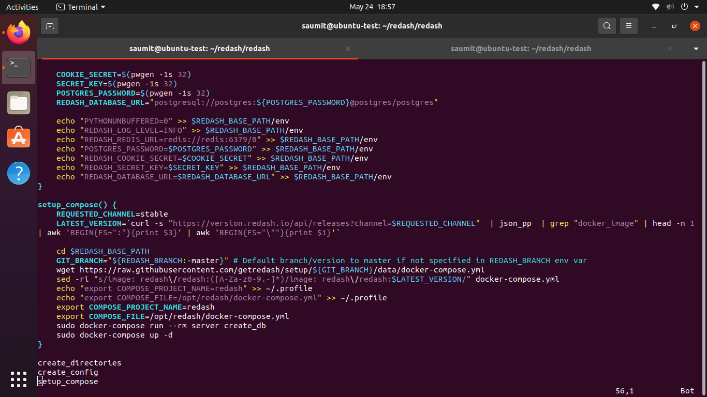
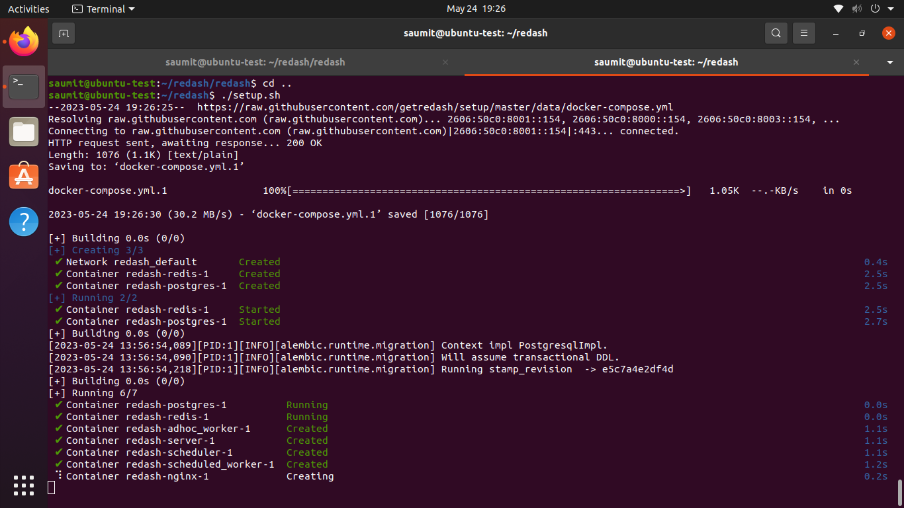
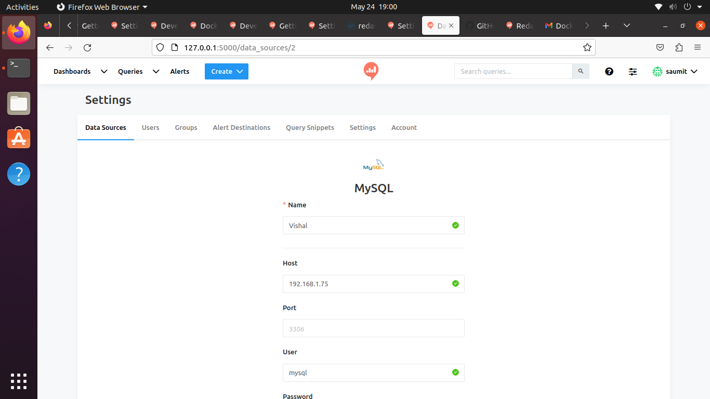
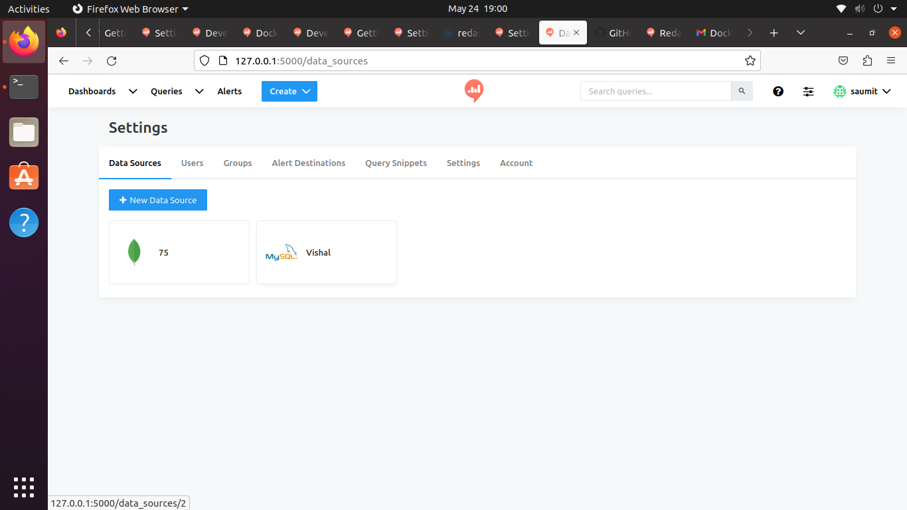
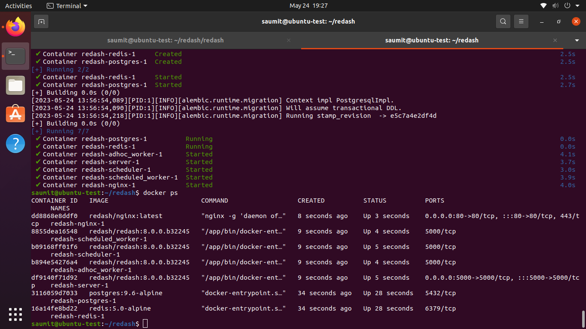

# Commands I Used

## Installing Docker engine on Ubuntu 20.04
```bash
sudo apt install docker.io
```
## Install Docker compose
```bash
sudo curl -L "https://github.com/docker/compose/releases/latest/download/docker-compose-$(uname -s)-$(uname -m)" -o /usr/local/bin/docker-compose
```
### Making the binary executable
```bash
sudo chmod +x /usr/local/bin/docker-compose
```
### Adding current user to docker group to avoid adding sudo for docker commands
```bash
sudo usermod -aG docker $USER
```
### Docker Compose in current directory
```bash
sudo docker-compose up -d
```
### Get the list of running Docker containers
``` bash
docker ps
```

### Docker Compose remove volumes and orphan containers
```bash
docker-compose down --volume --remove-orphans
```
### Getting valuable information about the running container
```bash
docker-compose logs <Continer-ID>
```

## Installing redash using script
```bash
wget https://raw.githubusercontent.com/getredash/setup/master/setup.sh
```
### Making changes to the script
```bash
vim  setup.sh 
```


### Making it executable
```bash
chmod +x setup.sh 
```
### Running the script
```bash
./setup.sh 
```


### Setting up MySQL as DataSource for Redash

### Setting up MySQL and MongoDB as DataSource for Redash

### Docker

