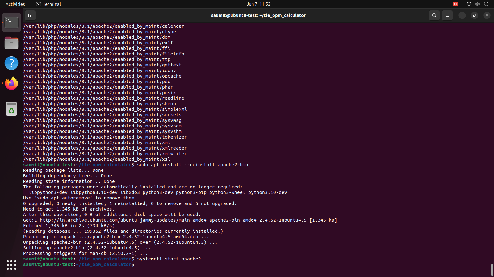
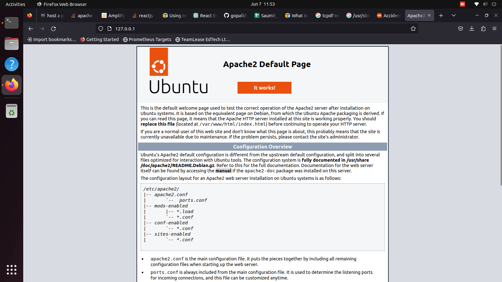
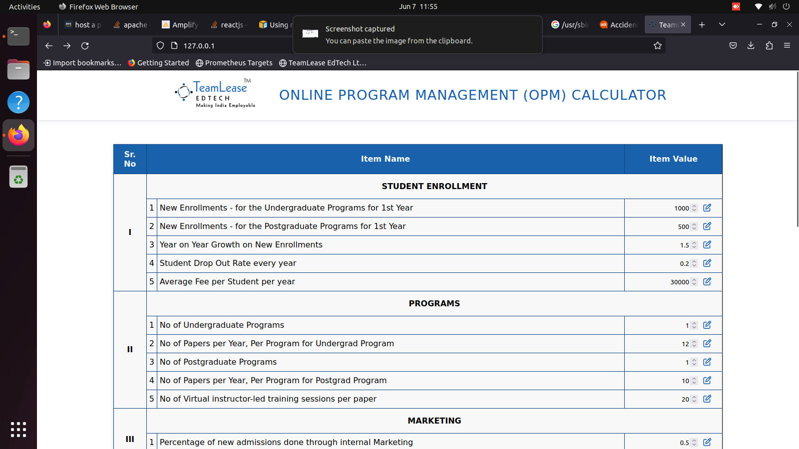
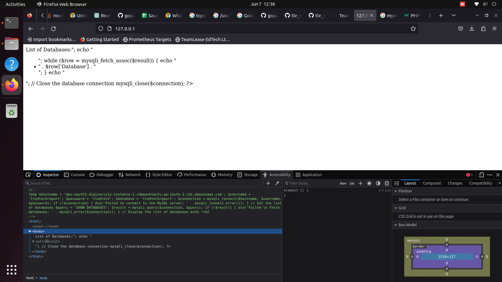
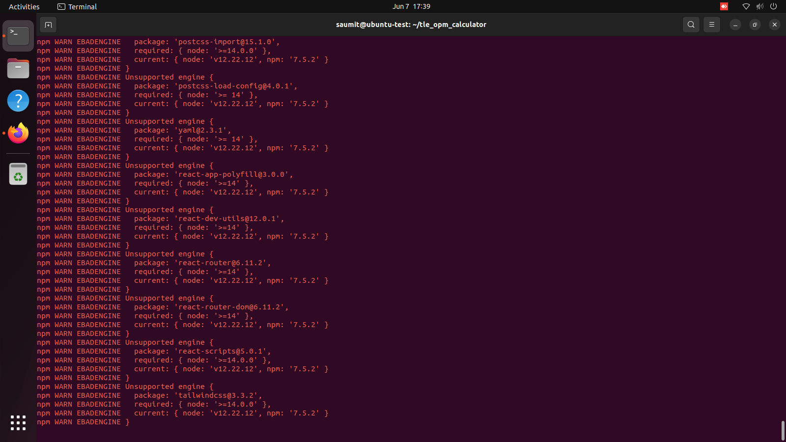

# Activities done
## Installing TLEOPM Calculator locally before deployement

1. Installing Apache locally

2. Adding Build files to Document root of Apache

3. Troubleshooting mysql-connector module for php

4. Node Dependencies showing error due to NodeJs from apt being outdated. (Used a script later to install newer version)
