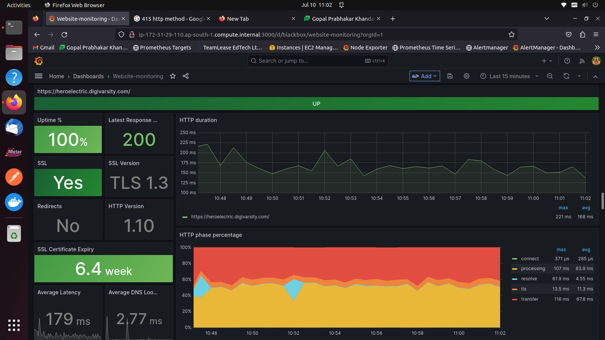

# Activities Done today

## Dashboard changes
### Website monitoring (Categorizing Response codes)
HTTP Response to this API url is 401
Which indicates that it is down, however in reality the URL is working it is that the scraping endpoint does not have valid credentials.
So made changes to the PieChart using PromQL accordingly to the URLs that are working but cannot be reached for 2xx.

#### Website Monitoring Dashboard

**Note:** URLs are yet to be screened out and filtered this is testing environment.

### Node Exporter full 
### Variable renaming
I think it is appropriate to use instance IP as node variable than the tagname, so made changes accordingly for that in a way tagname is dependent on instance.
### Extracting target Variable using regex
To get the number of instances displayed in the Overview Panel, I need to asssign $target variable properly.
However by using this PromQL I get a very crude value- `{} 50 1688970564000` instead of the desired value of `50`

So I made use of regex and made it so that the query only fetches me the text which is surrounded by regex in a way the `{}` is also accounted for and as sample query I recieve `50`

## Dashboard viewing + Alerts
### How dashboard looks when Two Sites were down

### Focused view

### Focused view - Issue Resolved

## Dropping RDP/Windows instances
Dropping Windows instances from scanning for now a node-exporter can only installed on \*NIX or UNIX-like OS.
There exists [windows-exporter](https://github.com/prometheus-community/windows_exporter) by prometheus team which I would look into in future, after I get the clearance to install it.
However, for now I'm trying to eliminate false negatives as much as I can.

### Instance Down Alerts before Dropping

### Instance Down Alerts after Dropping

